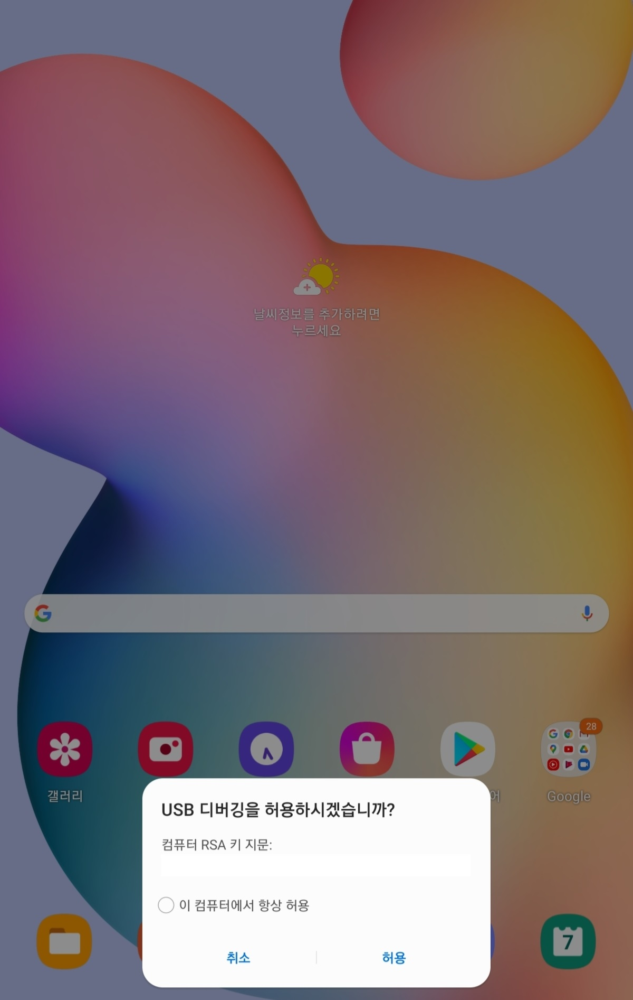

필자는 파이썬을 활용하여 안드로이드를 제어할 수 있다는 영상을 보게 되어 이러한 라이브러리 및 활용에 흥미를 느끼게 되었고, 본 글을 작성하게 되었다.  
사실 오래전에 한 개인 프로젝트 내용이라 거의 잊었지만 다시 되새기면서 작성한다.  
참고로 어플리케이션의 테스트 자동화를 만들었는데 아래 두 방식 모두를 사용하였다.

한편의 블로그에 기재하려 하였으나 내용이 긴 관계로 두 개의 글에 작성하도록 한다.

## 0. 환경 설정
1. ADB설치  
하기에 기술하는 두가지 방법 모두 안드로이드의 adb를 설치해야 한다.
안드로이드 스튜디오가 설치되어있는 경우에는 기본적으로 설치되어 있으며, 그렇지 않다면 하기 경로에서 다운로드 받도록 한다.
> https://developer.android.com/studio/releases/platform-tools?hl=ko

2. 안드로이드 폰의 USB 디버깅 모드 ON  
안드로이드 폰의 `설정 -> 휴대전화 정보 -> 소프트웨어 정보 -> 빌드번호옵션`을 7번 누르면 개발자 옵션이 활성화 되며 활성화 된 개발자 옵션은 `설정->개발자 옵션`에서 확인할 수 있다.  
개발자 옵션에서 `USB 디버깅`을 ON한다.  
※안드로이드 버전마다 다를 수 있으므로 상세한 내용은 하기 경로에서 확인한다.
> https://developer.android.com/studio/debug/dev-options?hl=ko

3. 안드로이드 폰과 테스트 PC와 USB연결

## 1. ADB 명령어를 이용한 안드로이드 폰 제어
### 1.1. ADB 및 pure-python-adb 소개
ADB를 사용하면 APK설치, 삭제, 기기 재부팅, 캐시메모리 삭제 등 다양한 동작을 수행할 수 있다.
이러한 ADB를 Python에서 제어할 수 있도록 하는 라이브러리는 
> pure-python-adb

이다.  
이 라이브러리를 활용하면 원하는 ADB명령어를 python안에서 호출 할 수 있다.
  
### 1.2. ADB Server 시작
1. window 키를 누르고 cmd를 검색하여 명령프롬프트 창을 띄운다.  
2. 설치된 ADB.exe 파일의 경로로 이동한다. (android의 sdk 폴더 -> platform-tools 폴더 내부에 위치)  
3. 안드로이드 폰과 테스트 PC를 USB로 연결하고 하기의 명령어를 실행한다.
```
adb server start 
```
4. ADB 서버 시작
5. 안드로이드 폰에서 디버깅 허용

### 1.3. ADB Client 작성
기본적으로 ADB server 는 127.0.0.1주소의 5037포트로 동작한다. 
따라서 클라이언트에 접속할 주소와 포트를 적어주고 서버에 연결되어있는 디바이스를 검색한다.  
본 예제는 한개의 디바이스를 연결하였으므로 devices[0]으로 첫번째 디바이스가 원하는 디바이스라고 가정한다.
```python
from ppadb.client import Client as AdbClient
client = AdbClient(host="127.0.0.1", port=5037)
devices = client.devices()
device = devices[0]
```

### 1.4. ADB 명령어 실행
ADB 명령어를 전달해 주는 API는 다음과 같다.
괄호 안에 문자열로 명령어를 전달하면 된다.
``` python
device.shell("am force-stop <package name>")
```
## 2. AndroidViewClient라이브러리를 활용한 안드로이드 폰 제어
다음 글에 작성  
  