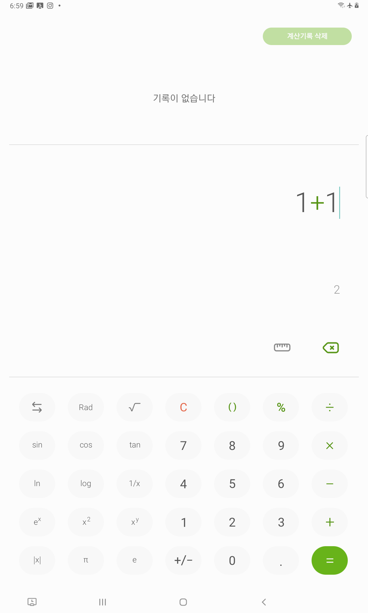

파이썬으로 ADB 명령어를 통해 안드로이드를 제어하는 방법은 이전글을 참조.

## 2. AndroidViewClient라이브러리를 활용한 안드로이드 폰 제어
AndroidViewClient도 ADB를 이용한 라이브러리이기 때문에 ADB서버 역시 실행되어야 한다.  

### 2.1. ADB Server 실행
ADB 서버에 대한 내용 및 실행방법은 이전 글 참조.

### 2.2. AndroidViewClient라이브러리 설치
아래의 명령어를 통해 라이브러리를 설치한다.
> pip install androidviewclient

### 2.3. ViewClient연결하기 및 계산기 실습
라이브러리가 정상 설치되었고, ADB 서버가 실행되었으며 안드로이드 폰이 연결되었으면 준비완료.  
바로 계산기 예제를 보자.

코드는 다음과 같이 작성한다.
```python
from com.dtmilano.android.viewclient import ViewClient

vc = ViewClient(*ViewClient.connectToDeviceOrExit())
vc.traverse()
```

vc.traverse( )는 현재 표시되고 있는 화면을 구성하고 있는 요소들을 트리 형태로 보여준다.  
계산기를 안드로이드 폰 화면에 표시하고 위의 코드를 실행시키면 결과는 다음과 같다.
1. 계산기 화면


2. 소스코드 실행 결과 화면


결과를 잘 살펴보자.  
> android.widget.Button com.sec.android.app.popupcalculator:id/calc_keypad_btn_01 1

위의 내용을 이해해 보자면 
* android.widget.Button의 버튼이 존재하고 
* 이는 com.sec.android.app.popupcalculator의 패키지 앱 안에 
* calc_keypad_btn_01의 id를 가지고 있으며 
* 1로 표시하고 있다.

가 된다.  

1 버튼의 id값을 취득하였으니 1을 제어할 준비가 되었다.  
아래의 소스코드를 입력하여 실행하고 1의 버튼이 눌렸는지 확인해 보자.  
```python
from com.dtmilano.android.viewclient import ViewClient

vc = ViewClient(*ViewClient.connectToDeviceOrExit())
vc.traverse()

vc.findViewById('com.sec.android.app.popupcalculator:id/calc_keypad_btn_01').touch()
```
위 소스코드에서 사용된 findViewById함수는 id값을 이용해 view를 찾는다는 얘기고 찾은 후 touch를 누른다는 내용이다.

위의 내용을 응용하여 2+2를 작성하는 소스코드를 작성하면 다음과 같다.  
```python
vc = ViewClient(*ViewClient.connectToDeviceOrExit())
vc.traverse()

# C버튼을 눌러 초기화
vc.findViewById('com.sec.android.app.popupcalculator:id/calc_keypad_btn_clear').touch()
# 2버튼을 누른다.
vc.findViewById('com.sec.android.app.popupcalculator:id/calc_keypad_btn_02').touch()
# +버튼을 누른다.
vc.findViewById('com.sec.android.app.popupcalculator:id/calc_keypad_btn_add').touch()
# 2버튼을 누른다.
vc.findViewById('com.sec.android.app.popupcalculator:id/calc_keypad_btn_02').touch()
```
위의 소스코드로 2+2버튼을 자동으로 누를 수 있게 된다.

### 2.4. 기타 내용들
Button이나 다른 View들도 모두 Touch함수를 사용하여 누를 수있다.
이와 다르게 EditText의 View는 setText()함수를 통해 원하는 Text를 넣어줄 수도 있고, Focus가 되어있는지여부, 클릭가능한지 여부 등의 내용도 역시 확인할 수 있다.
자세한 API는 공식 API문서를 참고 바란다.
> https://dtmilano.github.io/AndroidViewClient/