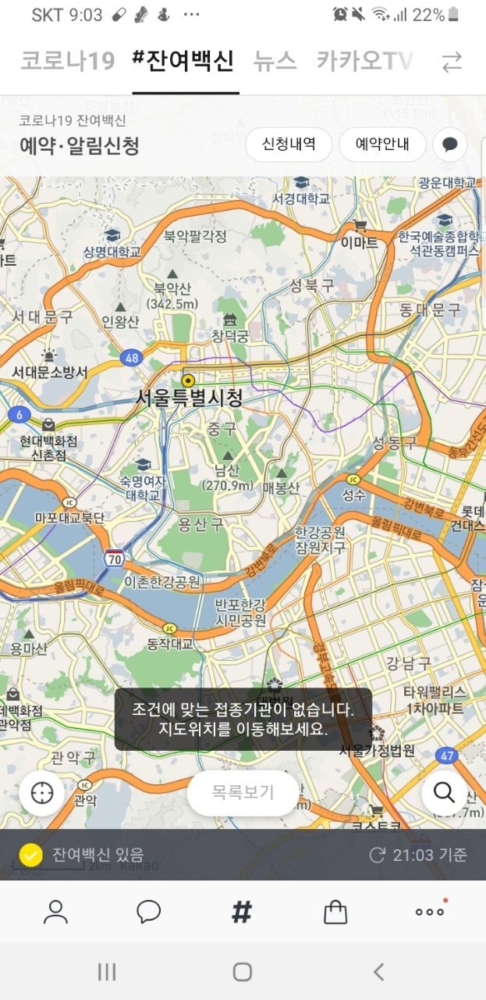
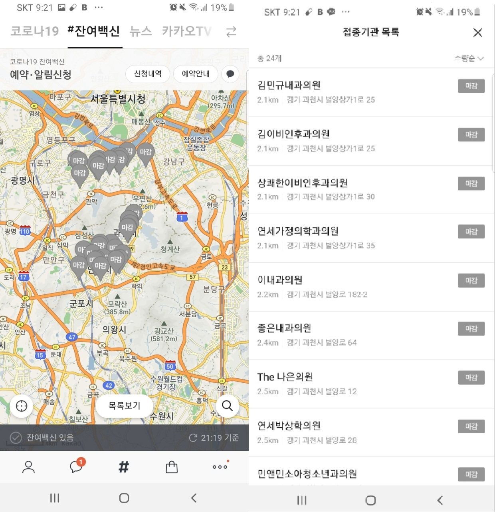
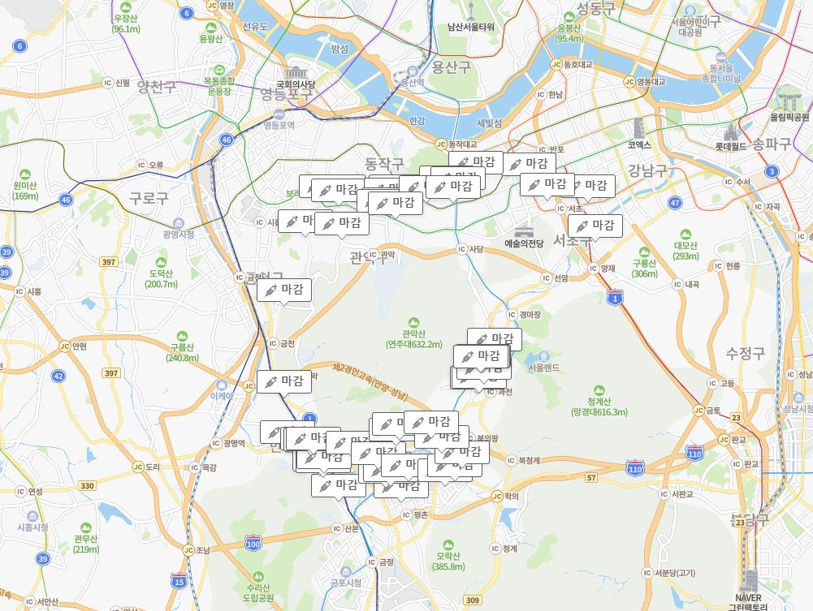
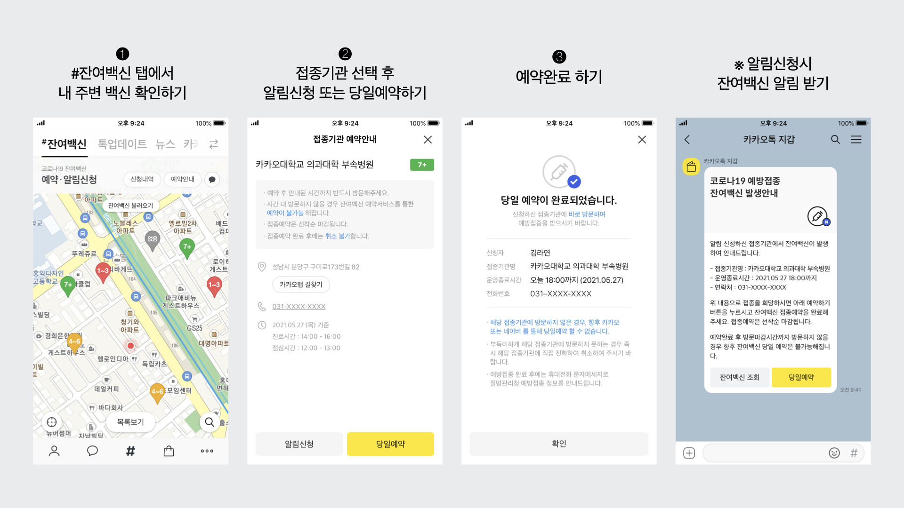
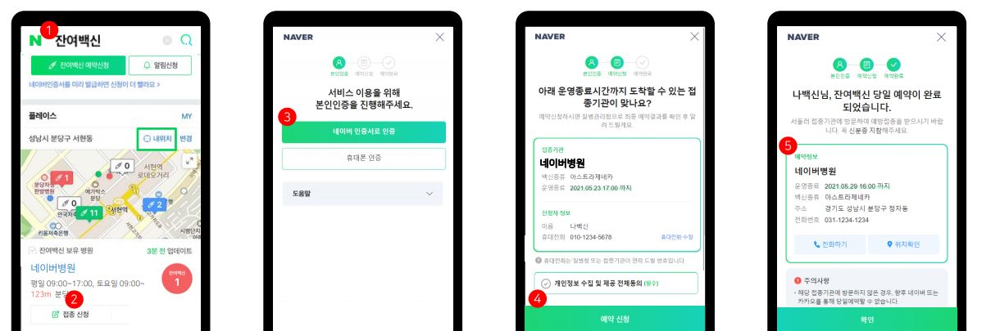

현재 잔여백신 신청이 하늘의 별따기와 같다는 말이 나오고 있다.  
잔여백신은 카카오와 네이버에서 신청이 가능한데, 어느 플랫폼에서 신청하는게 유리한지 살펴보자.  
참고로, 아래의 글은 본인의 생각을 정리한 것으로써 신뢰도는 각자가 판단하여 생각바란다.  
또한, 인증서 발급 절차를 생략하고 단순히 잔여백신이 발생하였을 때 신청하는 과정을 놓고 생각한 글이다.  
결론이 급하신 분은 글의 맨 밑을 확인하자.  

## 1. 지도 이동
잔여백신을 찾을 때 여러 지역을 살펴보면서 잔여백신이 존재하는지 여부를 보고 싶은 경우가 있다.  
본인이 갈 수 있는 반경 내의 지역을 살펴보며 새로고침을 하기위해서는 `카카오`가 편리하다.  
카카오는 지도를 움직이는 것 만으로도 현재 지도위치 기준으로 잔여백신 검색이 되기 때문에 네이버같이 현 지도에서 검색 버튼을 따로 누르지 않아도 되어 간편하다.  
  
  
## 2. 표시할 수 있는 병원의 범위
### 2.1. 카카오

22개의 병원이 검색되는 것을 볼 수 있다.  
만약 더 넓은 지도 배율에서 확인하더라도 여전히 같은 수의 병원만 표시한다.
### 2.2. 네이버

자세히 세어보지는 않았지만 40여개의 병원이 검색되는 것을 알 수 있다.  
따라서 `네이버`가 조금 더 많은 병원의 잔여백신을 검색 할 수 있다.

## 3. 백신을 발견하였을 때 백신 신청까지의 클릭 수
위의 과정을 반복하여 마침내 잔여백신을 발견했다고 가정하자.  
이제부터는 신청까지의 클릭수가 중요하다고 볼 수 있다. ( 네이버와 카카오 인증서가 미리 발급되었다고 가정한다.)

### 3.1. 카카오
카카오의 보도자료 이미지를 보자.  

여기서 단순 클릭 수만 계산하면, 
1. 지도에서 병원 클릭
2. 당일예약버튼
3. (이미지에는 없지만) 예약확인 팝업의 확인 버튼

총 3번의 클릭이 필요하다.  
  
### 3.2. 네이버 (모바일)
네이버의 단계를 보자.

네이버 앱을 사용하여 네이버 인증서가 이미 발급되어 있다면 단계는,
1. 새로고침후 잔여백신이 있는 병원이 발생하면 목록에 뜨고, 이때 접종신청버튼
2. 개인정보 수집 동의체크 (체크 후 신청 결과 실패까지 가면 다음 신청시 동의버튼이 생성되지 않음)
3. 예약신청버튼

### 3.3 네이버 (PC)
PC도 모바일과 동일하지만 본인인증을 한번 해야한다. 
이 인증은 웹브라우저를 종료할 때 까지 지속되며, 잔여백신을 발견하고 접종신청버튼을 클릭해야만 발생하기 때문에 첫 신청은 무조건 실패한다고 보면 된다. 
두번째 신청부터는 네이버-모바일과 동일한 단계로 이루어 져 있다.

### 3.4 정리
네이버 - PC의 경우는 단계가 많고 마우스 조작이 모바일의 터치 조작을 따라가기 힘들기 때문에 배제하는 것이 좋다.  
또한 네이버 - 모바일의 경우 최초 신청에만 개인정보 수집 동의체크가 있고 다음 신청부터는 존재하지 않아서 2번의 단계만 거치면 신청을 완료할 수 있게된다.
따라서 지도에서 병원을 찾고 잔여백신을 신청하는 경우에는 `네이버 모바일`이 가장 최소한의 단계로 신청가능한 방법이다.

## 4. [결론] 한개의 병원만 집중적으로 공략할 때 (Best)
동네마다 백신이 자주 나오는 병원이 있을 것이다. 이 병원을 집중 공략하는 것이 가장 좋은 방법이다. 이 방법은 네이버에서는 불가능 하며 카카오에서만 가능하다.
카카오에서 이러한 방법으로 하면
1. 새로고침
2. 당일예약버튼
3. (이미지에는 없지만) 예약확인 팝업의 확인 버튼
의 순서로 3단계를 거치지만 페이지의 이동이 없기 때문에 가장 빠른 속도로 예약이 가능하다.  
  