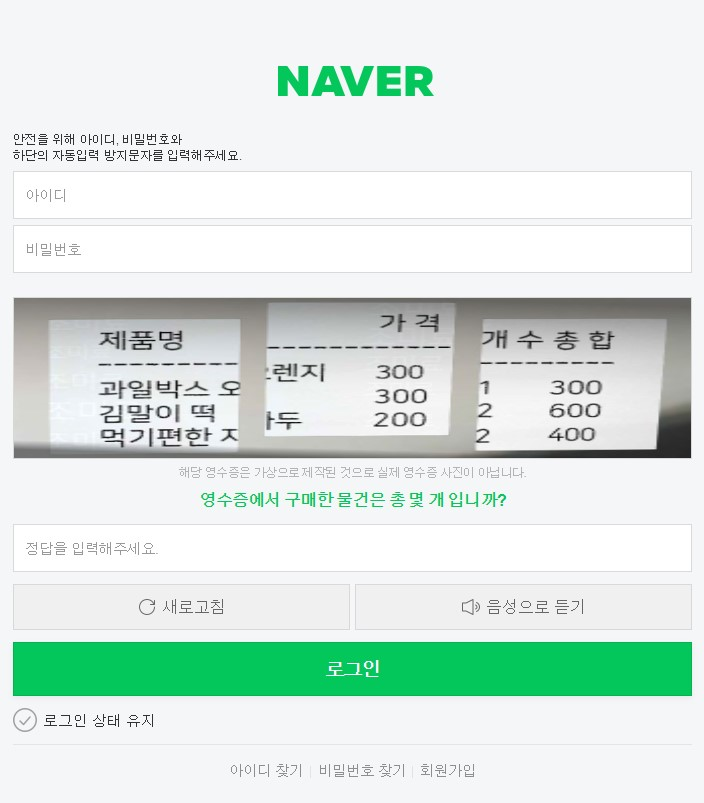
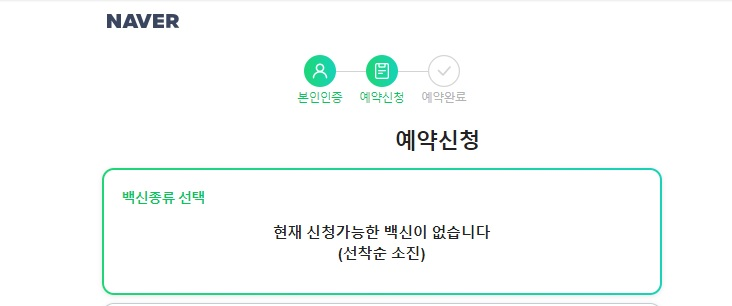
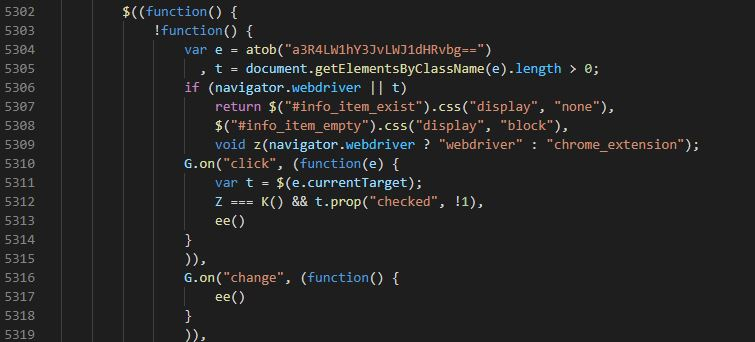

## 1. 개요
잔여백신에 관심을 가지고 몇번 시도해보면 만만치 않은 노동이란 것을 알게 된다.  
나보다 빠른 사람들은 누굴까? 하는 의문과 함께 아예 잔여백신이 존재하지 않는 것은 아닌가 싶은 경우도 있다.  
여기에 잔여백신 매크로가 있었고 현재는 막혔다고 기사가 난 것을 보면, 이제 매크로가 막혔나 보다 하는 사람과, 가능한 매크로가 있지 않을까? 하는 사람들로 나뉠 수 있는데, 필자는 개인 프로젝트로 셀레니움을 이용한 매크로를 종종 만들어봤기 때문에 어떻게 막을 수 있는지에 대해 의문이 생겼고, 방법을 알기 위해 분석하였다.  
본 글을 악용하여 매크로를 제작하는 사람이 있을 것 같아 글로 적지 않으려 하였지만, 이미 많은 개발자들이 소스공유와 방법을 공유하고 있고 이 내용들이 나의 분석내용과 일치하는 경우도 있었다.  
정보의 비대칭을 해소하기 위해 글을 적는다.  
  
## 2. 네이버는 매크로를 어떻게 막았을까?
### 2.1. 기존 네이버의 매크로 방지법
매크로를 활용하여 네이버 자동로그인을 시도해 본 사람들은 알 것이다.  
바로 자동입력 방지화면이다.

이 자동입력 방지 화면의 발생조건을 명확하게 분석하지는 않았지만, 이 글을 위해서 소스코드를 열어보니 꽤나 공을 들인 느낌이다.  
로그인 창에서 마우스의 움직인 이력, 키보드의 로그 심지어 기기의 동작까지 보는 듯 하였다. 오늘의 주제는 아니니 빠르게 닫고....  
`로그인이 매크로의 과정에서 필요한 경우 수동으로 기입할 시간을 주는게 정신건강에 좋아보인다.`

    
### 2.2. 잔여백신의 매크로 방지법(차단 방법)
잔여백신 매크로가 차단되었다고 하는데 어디서 차단된건가.. 어디서부터 동작이 되지 않는가를 파악하기 위해서는 역시 매크로를 만들어서 돌려보는게 빠르겠다 싶어서 다음과 같은 동작을 하는 매크로를 작성하였다.  
1. 지도에서 잔여백신 새로고침
2. 로그인한 브라우저에 개인 인증서 확인( 수동 - 최초 한번만 )
3. 잔여백신 발생시 해당하는 병원의 잔여백신 신청 페이지 진입
4. 잔여백신 수량 확인 한 뒤 예약버튼 클릭

위와 같은 동작을 하는 매크로를 돌려본 결과 수상한? 부분을 발견하였다.
지도에서 잔여백신이 발생하여 클릭하고 들어갔는데 잔여 수량이 없다는 경우가 계속 발생하는 것이다.  
(4번 동작에서 막힘) 

여기의 소스를 분석해보자.  
    

소스코드가 난독화 되어있지만 계속 보다보면 대충 감이 온다.  
(기존에 분석할 당시의 소스코드와 현재 소스코드가 조금 다르게 생긴 것 같다. 소스코드를 보아하니 크롬 확장프로그램에 의한 매크로가 플려 막힌 듯 하다)  
코드의 5306라인을 보면 navigator.webdriver의 값이 True이면 매크로로 인식하는 듯하다.  
5306라인의 t와 5309라인을 보면 예외처리된 매크로 방식이 구글 확장프로그램이란 것을 유추할 수 있다.  
아무튼 본인은 파이썬 셀레니움을 이용한 매크로를 사용하였고 5306라인에 의하여 막힌 것을 볼 수 있다. 2.1의 로그인에 사용한 난이도와 같은 매크로 방지법이 적용되어 있진 않았다.

## 3. 매크로 방지 회피하기
### 3.1. 웹드라이버를 사용하여 회피
간단한 구글링을 통하여 회피방법을 알 수 있기 때문에 본 블로그에서 기재한다.  
회피방법은 간단하다.  
  
웹드라이버의 옵션에 `--disable-blink-features=AutomationControlled`의 옵션을 주면 된다.

### 3.2. 웹드라이버를 사용하지 않고 회피
웹드라이버 말고 html 요소를 읽고 스크립트를 실행하는 방법은 많다.  
소스코드를 보면 알다시피 크롬 확장프로그램에서도 가능하고, 크롬이 아니더라도 다른 브라우저의 확장프로그램을 사용하면 매크로 방지를 우회할 수 있을 것 같다.  
잔여백신 서비스 자체가 짧은 시간에 개발되었기 때문에 매크로 방지 처리를 회피하는 것은 아직까지 쉬어보인다.

## 4. 다음글.
본 글을 읽고 매크로를 작성하고자 하는 사람에게는 안좋은 소식이 있다.  
위의 매크로 방식으로는 잔여백신을 얻을 확률이 매우 낮다.( 그냥 매크로 만들 시간에 수동으로 하는게 정신건강에 좋다.)  
커뮤니티 같은 사이트의 글을 보면 하루내지 몇일동안 새로고침만 눌러서 잔여백신을 시도하는 사람들이 많기 때문에 역설적으로 사람의 손이 매크로보다 더 빠른 상황이 된 것이다.  
다음글을 작성한다면, 보다 빠른 매크로를 만들기 위한 방법 및 그에 대한 네이버의 조치에 대한 내용을 작성하도록 하겠다.  
  