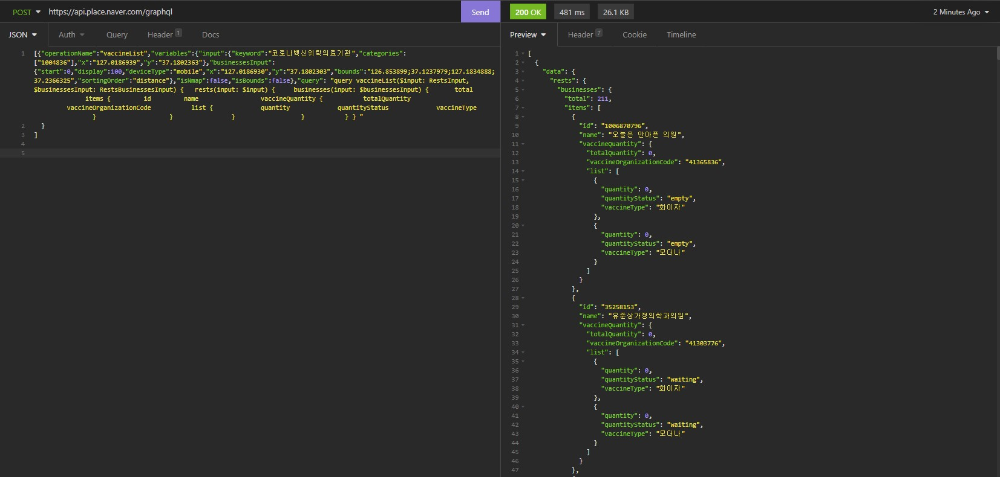
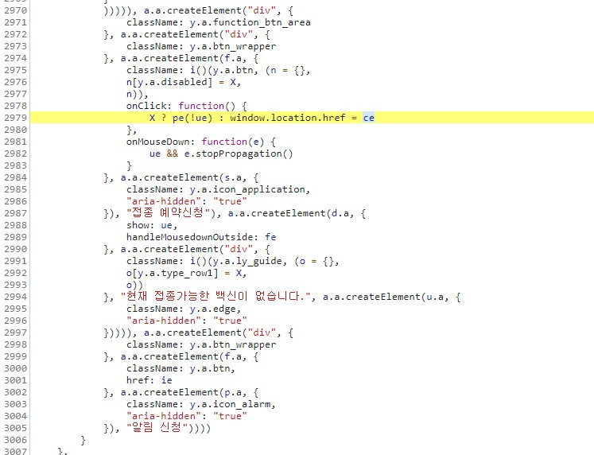
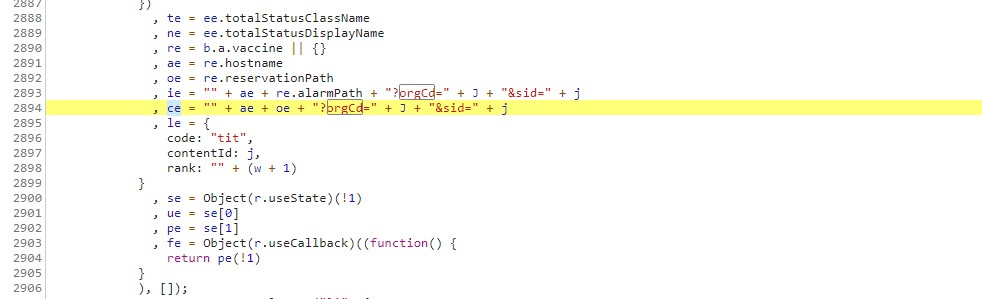
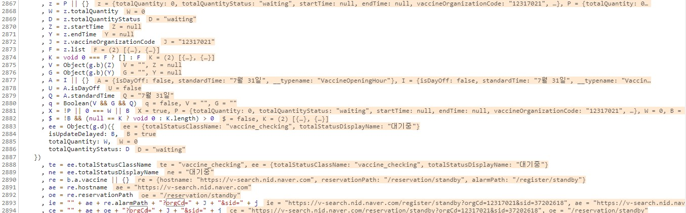

##  4. 보다 빠른 잔여백신 매크로(Ver 2) 만들기
이전글에서 제작한 잔여백신 매크로로는 3일동안 돌려도 예약이 되지를 않았다.  
아래의 이유중 하나가 있다고 생각하고 검토하였다.  
1. 백앤드 단에서 매크로 방지 코드가 더 있을 것이다.
2. 누군가 혹은 타인의 매크로가 본인의 매크로 프로그램보다 더 빠르게 예약을 선점한다.

일단 2번이라 가정하고 더 빠른 매크로를 제작하고자 하였다.  
  
### 4.1. 새로운 매크로 제작의 시작
이에 대한 방법의 해결방법은 잔여백신 소스코드를 분석하다가 힌트를 얻었다.
이전의 잔여백신 매크로는 이전글에 설명하였듯,  
1.  지도에서 잔여백신 새로고침
2.  로그인한 브라우저에 개인 인증서 확인( 수동 - 최초 한번만 )
3.  잔여백신 발생시 해당하는 병원의 잔여백신 신청 페이지 진입
4.  잔여백신 수량 확인 한 뒤 예약버튼 클릭  

이러한 방법인데, 여기서 지도에서 새로고침 하고 받는 방식이 graphql을 통한 방식임을 알게 되었고, 서버에서 요청하는 곳에 대한 검증을 따로 하지 않는다는  것을 찾았다.
[graphql 요청 사진..]
그렇다면 남들은 위의 방법 중 `1. 지도에서 잔여백신 새로고침`을 1초마다 한번씩 하여 검색할 때 0.5초마다 새로고침 하면 남들보다 빨리 발견할 수 있는 확률이 늘어나지 않을까 하여 두 번째 매크로를 만들게 된다.
또한 기존에 새로고침을 누르면 서버에서 잔여백신에 대한 데이터 뿐만 아니라 병원들의 이미지, 전화번호, 업무시간까지 불필요한 정보들을 다량 응답받기 때문에 응답이 느리다고 생각하고 만드는 김에 필요한 데이터만 요청하기로 한다.  
  
### 4.2. graphql의 쿼리 제작
네이버에서 사용하는 rest api는 graphql을 사용하여 구성되는 것으로 보인다. 이것의 많은 특징중 하나는 쿼리를 다르게 하여 원하는 내용만 응답으로 받을 수 있다는 점이다.  
새로고침을 눌렀을 때 서버로 보내는 쿼리를 조금 변형 시켜 잔여백신 데이터만 요청하는 쿼리를 다음과 같이 만든다.
```json
[{"operationName":"vaccineList","variables":{"input":{"keyword":"코로나백신위탁의료기관","categories":["1004836"],"x":"127.0186939","y":"37.1802363"},"businessesInput":{"start":0,"display":100,"deviceType":"mobile","x":"127.0186930","y":"37.1802303","bounds":"126.853899;37.1237979;127.1834888;37.2366325","sortingOrder":"distance"},"isNmap":false,"isBounds":false},"query": "query vaccineList($input: RestsInput, $businessesInput: RestsBusinessesInput) { rests(input: $input) { businesses(input: $businessesInput) { total items { id name vaccineQuantity { totalQuantity vaccineOrganizationCode list { quantity quantityStatus vaccineType } } } } } } "
}
]
```
  
  
또한 insomnia라는 프로그램을 통해 api가 정상 작동하는지 테스트한다.  


파이썬의 request 모듈을 통해 위와 같은 쿼리를 요청 받는지 확인 한 뒤 응답결과를 분석하여 백신이 있는 경우에만 `3.  잔여백신 발생시 해당하는 병원의 잔여백신 신청 페이지 진입`을 수행하도록 한다.  
여기서 어떻게 특정 병원의 백신 신청화면의 url을 알 수 있을까?  
### 4.3. 특정 병원의 백신 신청화면 얻기  
이 또한 소스코드를 분석하면 알 수 있다.( 확실히 매크로 구현당시에 봤던 소스코드보다  현재 블로그를 작성하기 위해 소스코드를 다시 보니 여러 조건들이 더 생긴 느낌이다. 무언가 여러 매크로 경로가 차단되고 있는 느낌이다..)

소스코드를 보면 2987라인에서 접종 예약신청 버튼을 생성하는데, 2979라인을 보면 ce의 주소로 이동시키는 버튼이란 것을 알 수 있다.  
ce를 알기위해 위를 찾아보자.  
  
  
매크로를 만들 당시에는 ce를 알기위해서 알림 예약신청버튼의 url을 참고하여 유추하였었는데, 현재 블로그 글을 작성하며 보니 웹브라우저의 디버그 모드를 활용하여 바로 주소를 찍어낼 수가 있었다.  
(사실 웹을 요즘 공부하고 있다. 글쓰며 하나 더 배워갑니다~)
  
이 url로 병원의 코드와 백신에 대한 코드 두 개를 넣으면 동적으로 변경되는 url을 찾아 리다이렉트 시켜 웹페이지에 표시한다.   
이 url은 소스코드의 ce부분 
`https://v-search.nid.naver.com/reservation/standby?orgCd=12317021&sid=37202618`이다.  
이곳의 orgCd와 sid의 코드에 따라 어느 병원인지가 바뀌는데 설명이 길어지므로 결과만 작성하면, orgCd는 vaccineOrganizationCode의 응답, sid는 id의 응답값이 된다.   
  
### 4.4.  매크로 완성
모든 준비가 끝났다.  
4.2의 쿼리로 서버에 요청하고 응답을 받으면 백신이 있는지, 잔여량이 몇 개 인지, 어느 병원인지 알 수가 있으며, 그 병원의 url로 접속하면 바로 예약을 할 수 있는 조건이 된 것이다.  

매크로 Ver1보다 더 빠르게 요청받고, 더 빠른 응답을 받을 수 있으며 누구보다 빠르게 병원 url을 찾아 들어갈 수 있으며 예약을 할 수 있게 되었다.  

## 5. 매크로 Ver2의 결말
### 5.1 실패 후기
결론적으로 말하자면 이 매크로로 이틀동안 예약을 시도했지만, 역시 실패를 한다.  
예약을 계속 시도하지만 성공을 하지 않는다...  나름 속도도 개선하여 어떠한 사람들보다 네이버 예약에 있어서 빠르게 잔여백신을 클릭할 것이라고 확인을 가지고 있는 상태였다.  
처음에 의심했던 프론트 단에서 미처 분석하지 못했던 방어 코드가 존재하거나, 백앤드 단에서 비정상적인 요청을 하여 막히지 않았을까? 라는 의문이 들었고, 매크로 제작에 흥미가 떨어지기 시작하였다.  
  
### 5.2 더더 빠른 매크로(Ver3) 만들기
이때 손으로 잔여백신 신청하는 사람은 도대체 어떻게 성공 할 수 있는 것인가? 라는 의문에 여러 글을 찾기 시작하고 카카오 예약방법, pc예약방법, 네이버 어플을 이용한 예약방법을 찾아 비교해보았다.  
이에 대한 비교글은 본 블로그의 다른 글 (https://donghyuna.github.io/%EC%9D%BC%EC%83%81/%EC%9E%94%EC%97%AC%EB%B0%B1%EC%8B%A0-%EB%84%A4%EC%9D%B4%EB%B2%84-vs-%EC%B9%B4%EC%B9%B4%EC%98%A4-%EA%BF%80%ED%8C%81/)을 참고 바란다.  
위와 같은 글을 읽고 카카오에서 새로고침을 하는 사람들과 동일한 속도거나 그 이상의 성능을 내기 위해 매크로 (Ver3)을 구상한다.  
미리 말하자면 Ver3은 성공 모델이다.
그 방법은 다음 글에서 작성하겠다.  
  