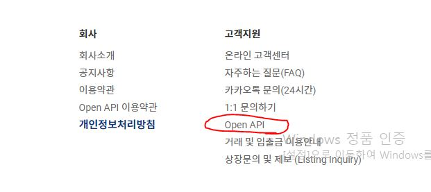
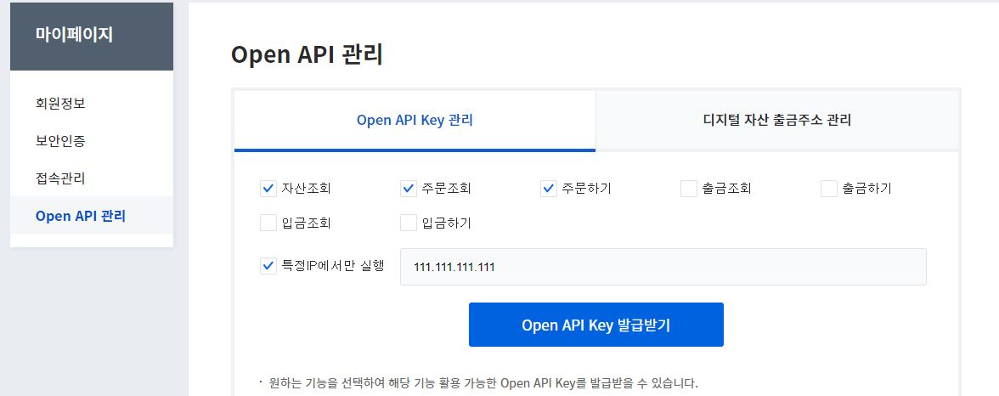

요즘 가상화폐 및 코인에 대해 많은 사람들이 관심을 가지고 있는 듯 하다.

필자는 이 가상 화폐의 성장가능성이나 가치에 대해 이야기 하지는 않겠다.

하지만 많은 거래소들이 코인에 대한 시세조회나 자동 매매 및 매수하는 api를 제공한다는 것을 알았을 때, 이를 활용하여 프로그램을 작성해야겠다고 생각하였다.

그리하여 api를 활용한 매매기법이 무엇일지 찾아보았고, 변동성 돌파전략을 활용한 프로그램이 유명하고 이에 대한 예제가 타 사이트에 잘 기재된 것을 보았지만, 
필자가 궁금했던 것은 바로!!

알트코인이 갑자기 오르는 시점!이 궁금하다는 것이다.
가만히 보면 처음듣는 코인들이 어느 시점에 갑자기 급등하는 모습을 볼 수 있다.

그래서 이를 찾고자 하는 생각에 '펌핑탐지기'나 '고래탐지기'라는 별명으로 부를 프로그램을 작성하기에 이른다.

앞으로의 글은 본 프로그램을 작성하는 과정이 될 것이다.

이에 대한 효과와 수익률은 마지막 글에 기재하겠다.

## 1. 업비트에서 api요청하기
### 1.1. 업비트 접속 후 api 항목 선택
 

### 1.2. 마이페이지에서 API KEY 발급받기
API KEY로 하고싶은 기능을 선택하여 발급받는다. 
특별히 출금과 입금을 자동으로 하지않을 것이므로 해당하는 내용만 선택하였다.   
(출금과 입금도 자동으로 하실분들은 체크하여 발급받기)
 
* 본인의 IP를 알고 싶다면 네이버에서 '내 IP'라고 검색하면 바로 알 수 있다.
  
### 1.3. 발급받은 API KEY 저장
발급받은 API KEY는 Secret key와 Open API Key가 있어야 정상적인 주문이 가능하다.
이중 Secret key는 발급시에만 확인 가능하니 꼭 다른 곳에 저장하여 두자.

## 2. 업비트를 제어할 라이브러리 설치하기 (pyupbit)
업비트에서는 Rest API를 통한 정보 수신방법과, WebSocket방식을 활용한 정보제공 방법 두가지를 제공하고 있다.
이를 사용하기 편리하게 만든 파이썬 라이브러리 'pyupbit'를 설치해주자.
> pip install pyupbit

설치후 사용 방법은 아래와 같이 import하여 사용한다.
인증키가 제대로 동작하는지 아래 코드를 입력하여 실행시킨다.  
아래의 코드에서 access와 secret는  1.3에서 저장한 KEY를 입력하면 된다.
```python
import pyupbit

access = ""
secret = ""
upbit = pyupbit.Upbit(access, secret)

print(upbit.get_balances())
```
본인이 가지고 있는 금액이 출력되면 성공  
출력예시는 다음과 같다.

>[{'currency': 'KRW', 'balance': '현재보유금액', 'locked': '0.0', 'avg_buy_price': '0', 'avg_buy_price_modified': True, 'unit_currency': 'KRW'}]

다음 글에서 기본적인 정보 조회 및 가공에 대한 내용을 작성한다.