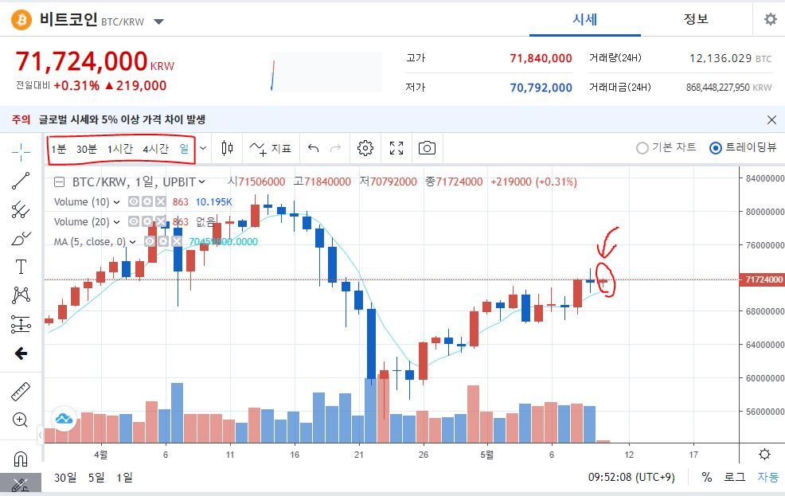
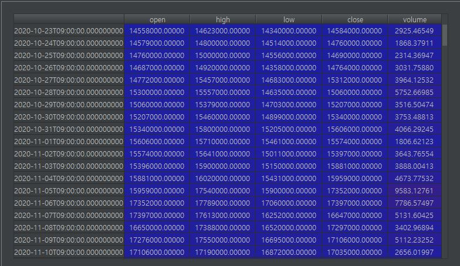

이번 글은 펌핑 탐색을 하기 전 기본적인 시세와 거래량을 조회하는 방법을 기재한다.

## 3. 기본적인 기능 API설명
아래의 설명에 등장하는 코드들은 하기의 코드가 존재하여야 실행되는 코드이다.  
이에대한 설명은 이전글 참조
```python
import pyupbit

access = "발급받은 key"
secret = "발급받은 key"
upbit = pyupbit.Upbit(access, secret)
```
### 3.1. 원화로 거래되는 코인 종류 취득
먼저 모든 코인의 시세를 알아보기 위해서는 원화마켓에 등록되어 있는 코인의 심볼을 얻어와야 한다.

```python
import pyupbit

print(pyupbit.get_tickers("KRW"))
```
위의 코드를 실행하면 코인들의 심볼값을 얻을 수 있다.
> ['KRW-BTC', 'KRW-ETH', 'KRW-NEO', 'KRW-MTL', 'KRW-LTC', 'KRW-XRP', 'KRW-ETC', 'KRW-OMG', 'KRW-SNT' ...

### 3.2. 코인의 현재가격
코인을 매수하거나 매도하기위해 현재가격을 취득할 때 사용한다.
```python
pyupbit.get_current_price("KRW-BTC") # 조회를 원하는 심볼값
```
  
### 3.3. 코인의 평균가격
코인을 매도하고자 할 때 이득이나 손절을 판단하기 위해 본인이 구매한 평균 코인 가격을 취득할 때 사용한다.
```python
upbit.get_avg_buy_price("KRW-BTC") # 조회를 원하는 심볼값
```

### 3.4. 현재 보유한 코인의 수량
```python
unit = upbit.get_balance("KRW-BTC") # 조회를 원하는 심볼값
```

### 3.5. 현재 가격에 매도
```python
upbit.sell_market_order(ticker, unit) # ticker : 매도를 원하는 심볼값
```
이때 unit은 3.4.에서 구한 코인의 수량을 넣으면 현재가격에 보유한 모든 코인을 판매하는 코드가 된다.

### 3.6. 캔들 조회하기
보통 트레이딩 창에서 차트를 볼때 여러개의 봉으로 이루어진 차트를 보게되고 봉에는 시작가격 , 끝의 가격, 거래량, 최고점, 최저점의 정보로 이루어지고 있다.  
이때 차트를 1분, 30분, 1시간, 4시간, 일 등 여러가지 봉으로 조회할 수도 있다.
 

이를 제공하는 api는 다음과 같다.
```python
"""
ticker: 조회를 원하는 심볼값
interval: 조회 하고자하는 차트 종류 (ex. 1분, 30분, 일 ...)
count: 조회하고자 하는 데이터의 수 (캔들 개수)
"""
pyupbit.get_ohlcv(ticker, interval, count=count) 
```
참고로 interval에 넣을수 있는 값은 다음과 같다.   
"day", "minute1", "minute3", 
"minute5", "minute10", "minute15", "minute30", "minute60", "minute240", "week",  "month", 

위의 api를 실행하면 리턴값은 pandas의 데이터프레임 형식이다.
혹시나 에러가 발생한다면 pandas를 설치해주자.
> pip install pandas

결과값인 데이터프레임의 예시이다.
 

여기서 각 날짜별 시작가(open), 고가(high), 저가(low), 종가(close), 거래량(volume)데이터를 얻을 수 있다.  
이제 무언가를 만들 수 있는 준비가 되었다.  

다음글에서는 고래(알트코인 펌핑)를 탐지할 수 있는 api를 만들어보자.