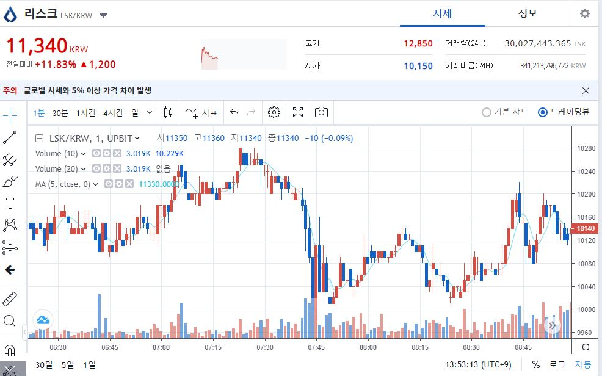
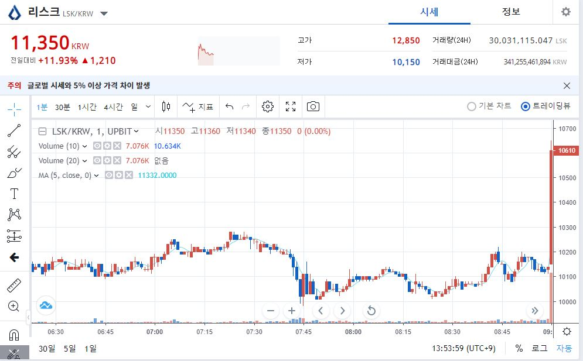
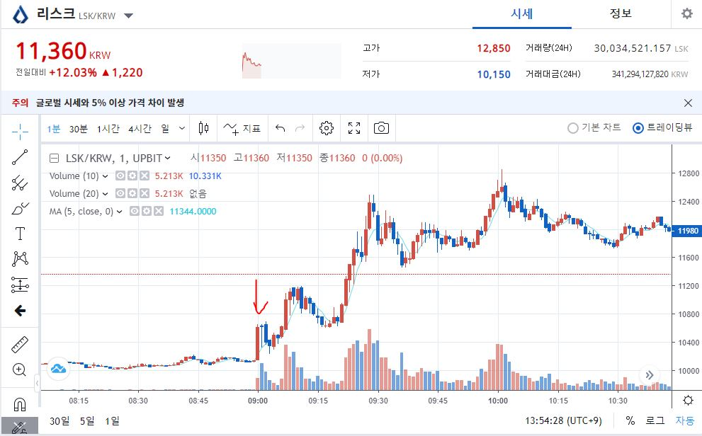
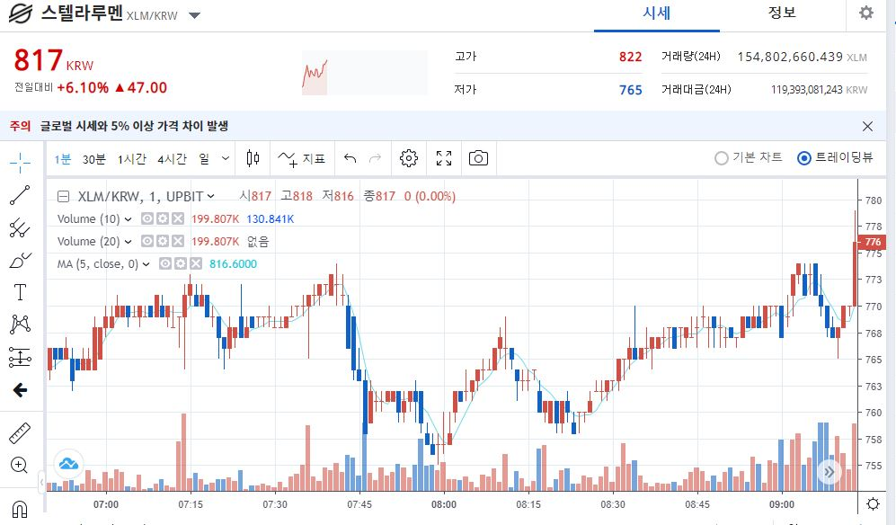
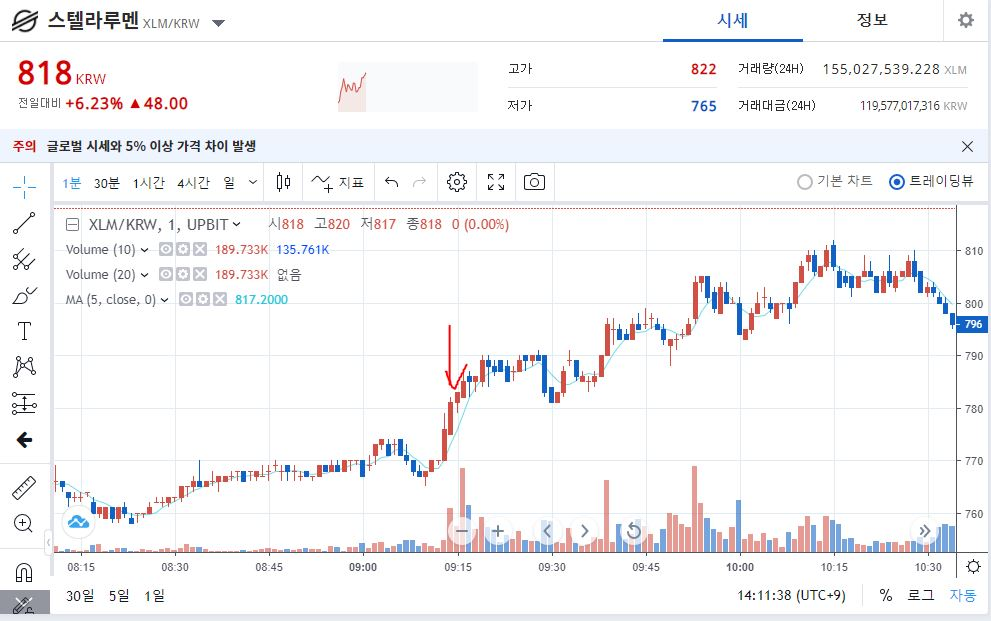

이번 글에 작성하는 펌핑감지 방법은 필자가 생각한 방법이며, 이에 대한 전문성과 정확성은 보장하지 않는다. 또한 이를 이용하여 정신적, 물질적, 금전적 피해 또한 보장할 수 없다.  
순전히 코딩하는 사람의 입장에서 현상을 관찰하고 이를 이용해보고자 하는 생각에서 작성된 글임을 알린다.

## 4. 알트코인의 펌핑 현상 관찰
매일매일 무섭게 오르고 내리는 알트코인 중 오르는 알트코인에 집중하여 관찰하였다.  
이 글의 작성 당일 리스크라는 알트코인이 올라 이를 예시로 한다.  

### 4.1. 리스크코인의 1분 차트
 
위의 차트는 8시 59분의 모습이다.  
밑의 차트는 1분 뒤인 9시 모습.
 
갑자기 거래량과 가격이 폭등하는 모습니다.  
 
어느정도 시간이 흐른뒤 차트.
  
위의 차트를 비교해보면 어느 시점에 거래량이 증가하면서 가격이 상승함을 명확히 알 수 있다.  
### 4.2. 스텔라루멘코인의 1분 차트
이 글의 작성 현재시간 상승률 2위인 스텔라루멘의 가격도 보자.
 
13분까지 일반적인 소소한 상승중인 가격
 
14분부터 갑자기 거래량과 가격이 급상승을 하는 모습을 보인다.

### 4.3. 결론
이렇게 관찰한 결과 펌핑은 갑작스러운 거래량 증가와 함께 온다는 (성급한?)결론을 내릴 수 있다.
따라서 일정기간 평균 거래량보다 몇 배 이상의 거래량 증가와 상승 중이라면 자동으로 매수를 하는 프로그램을 작성해보자.

### 4.4 고려할점
필자가 이미 프로그램을 작성하여 돌리던 중 불필요한 코인들을 매수하는 경향이 발견되었다.  
이는 거래량이 어느 일정 수준 미만인 알트코인들은 조금의 거래량이 증가하여도 몇 배로 튀는 값을 가지고, 프로그램이 이를 펌핑 현상이라 판단하는 문제가 있다.
이를 고려하여 회피해야 한다.

다음 글에서는 위에서 분석한 내용을 코드로 작성하여 보자