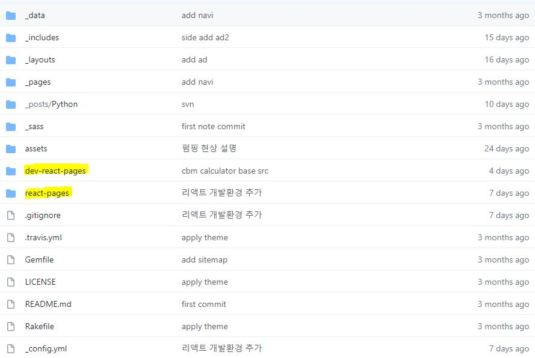
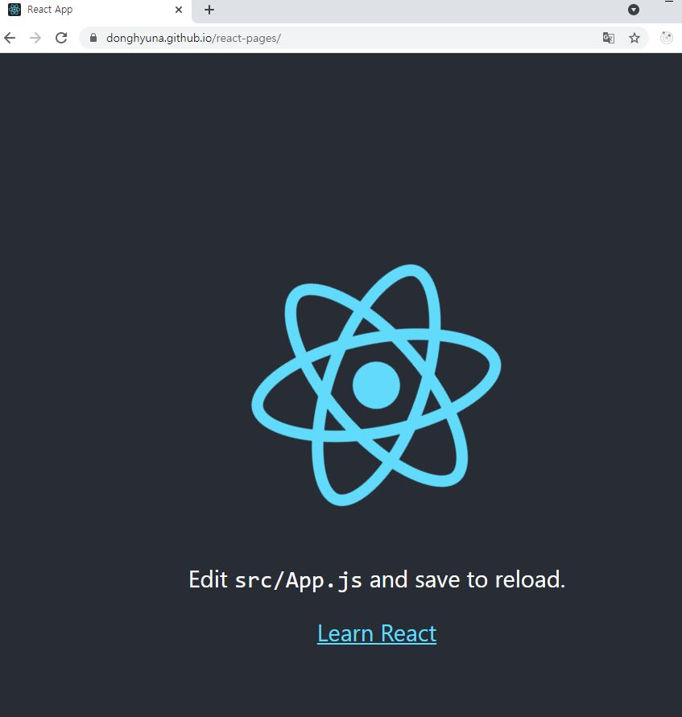

요즘 지킬 블로그를 운영하면서 react도 공부하려고 한다.  
간단한 기능들을 react페이지로 구현하면서 이를 사람들에게 공유도 할 계획을 가지고 있다.  
react페이지를 배포할 플랫폼은 많지만, 따로 플랫폼을 구하지 않고, 바로 지킬 깃허브 블로그에 react페이지를 추가해 보려고 하였고, 이러한 내용이 잘 기술되어 있는 블로그를 참고하여 작성하여 본다.  
이렇게 react페이지를 구성하고 나면 donghyuna.github.io(블로그주소)/react-pages로 접속 할 수 있는 장점이 있다.

## 1. 들어가기전
예상독자는 react에 대해 기본적인 프로젝트르 생성해 본 적이 있고(create-react-app), 지킬블로그를 운영하거나 할 계획에 있는 분.  
그에 대한 nodejs나 기타 모듈이 설치되어 있는 독자를 예상독자로 염두하여 두고 작성한다.

  

## 2. 지킬블로그 공간에 react 프로젝트 생성
지킬 블로그가 운영되고 있는 githubpage 루트 공간에 가서 다음과 같은 명령어를 작성하여 기본적인 react개발 프로젝트를 생성한다.  
> npx create-react-app dev-react-pages(폴더명 자유)

## 3. 배포 전용 폴더 생성
또한 개발이 완료된 react 페이지를 배포하기 위해 배포 전용 폴더를 생성해보자.  
react-pages(폴더명 자유)

프로젝트와 배포전용 폴더를 생성하였으면 아래와 같은 구조가 되었을 것이다.
 
  

## 4. 개발전용 파일을 배포하지 않도록 하기
### 4.1 .gitignore
깃허브에 커밋할때 node_modules이나 빌드한 결과를 제외할 수 있도록 한다.  
루트 폴더에 존재하는 .gitignore 파일내부에 다음과 같은 구문을 추가한다.
```
dev-react-pages/node_modules/
dev-react-pages/build/
```

### 4.2 _config.yml
지킬에서 react 개발에 필요한 프로젝트 폴더를 알 필요는 없으므로 이를 제외하도록 한다.  
루트 폴더에 존재하는 _config.yml파일 내부에 다음과 같은 구문을 추가한다. (exclude가 존재하면 하위에 작성하면 된다.)
```
exclude:
  - node_modules
  - dev-react-pages
```

## 5. react페이지가 표시될 주소 정하기
본인은 리액트 페이지가 [donghyuna.github.io/react-pages](https://donghyuna.github.io/react-pages/)의 주소에서 표시 되도록 작성해보았다.  
위에서 생성한 react프로젝트 폴더 내부에 package.json파일을 열어 아래와 같은 내용을 추가한다.
```
"homepage": "/react-pages/"
```
물론 위의 "/react-pages/"는 원하는 내용으로 변경하여도 된다.

## 6. 빌드 및 배포 스크립트 작성
react 페이지를 배포하기 위해서는 우선 빌드를 하고 빌드된 결과를 배포전용 폴더에 옮겨준 뒤 커밋하면 배포가 완료된다.
위의 내용을 편하게 하기 위해 react프로젝트 폴더 내부의 package.json파일에 아래의 내용을 추가한다.  
추가할 위치는 
``` javascript
"scripts": {
  "start": "react-scripts start",
  "build": "react-scripts build",
  "test": "react-scripts test",
  "eject": "react-scripts eject",
  // 추가 위치
},
```
### 6.1 운영체제가 window인 경우
```javascript
    "predeploy": "npm run build",
    "purge": "rmdir /s /q ..\\react-pages\\static && xcopy .\\build\\* ..\\react-pages\\ /E /y",
    "deploy": "npm run purge && npm run frontmatter"
```

### 6.2 운영체제가 리눅스인 경우
```javascript
  "predeploy": "npm run build",
  "purge": "rm -rf ../awesome-tools/static && cp -fR ./build/* ../awesome-tools",
  "frontmatter": "echo '---\ntitle: Awesome Tools\nlayout: null\n---\n' | cat - ../awesome-tools/index.html > temp && mv temp ../awesome-tools/index.html",
  "deploy": "npm run purge && npm run frontmatter"
```
 
## 7. 배포하기
yarn run deploy의 명령어를 작성하여, 프로젝트를 빌드하고, 결과를 배포 폴더에 옮긴다.  
위의 과정을 성공적으로 완료하였다면, 내용들을 커밋하여 준다.

[donghyuna.github.io/react-pages](https://donghyuna.github.io/react-pages/)에 접속하여 react기본 프로젝트 페이지가 보이는 것을 확인한다.
(앞으로 저 페이지를 꾸밀 것이기 때문에 내용은 사진으로 대체한다.)
 
 

## 8. 참고 사이트
https://www.blairanderson.co/2020/create-react-jekyll/